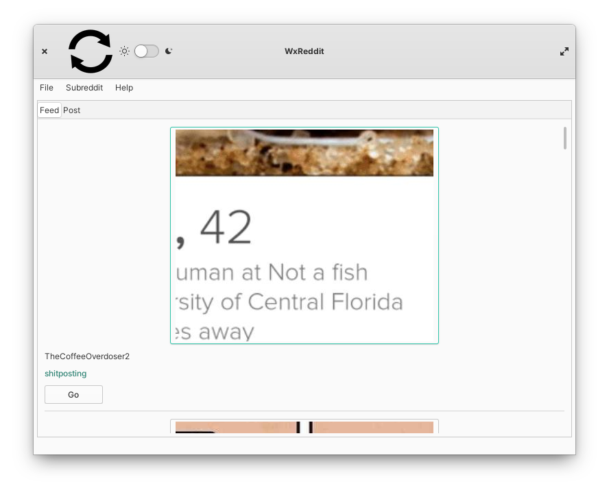

# WxReddit

### Made to work on very old devices, but also on new ones.

This will compile under wxWidgets 2.8 up to
3.1 (newest at time of writing).

No login functionality yet so when compiling a file in the root
directory needs to be made called SECRETS.h (a template is provided in the same directory).

Has a bare wxWidgets mode, as well as tweaks for desktop linux
such as libgranite support for freedesktop dark-theme preferences.

## Modern Linux

## OSX Tiger

Working, will get screenshot ASAP.

## Windows XP

Cannot compile yet due to win32 library madness.